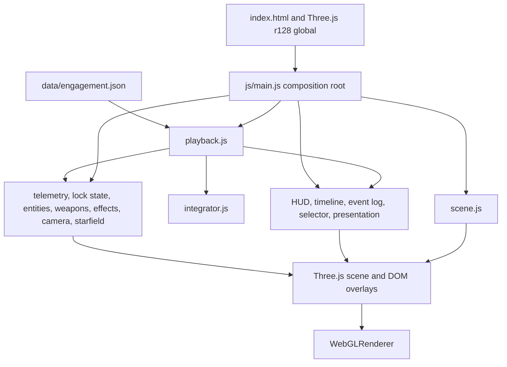

# System Architecture

## Scope and runtime

The application is a static, browser-only viewer for pre-authored engagement
telemetry. It does not simulate ship thrust, ingest ACMI, run a backend, or
provide a live flight model. The browser loads `index.html`, Three.js r128
from cdnjs, native JavaScript ES modules from `js/`, and the selected JSON
collection from `data/engagement.json`. Serve the repository over HTTP; opening
the page through `file://` prevents the dataset fetch.

The SYS-* names below are documentation groupings, not software packages or
runtime services. They describe today's implementation rather than proposed
WebGPU, TypeScript, TSL, model-loading, or live-simulation systems.

## System map

`main.js` is the composition root and animation-loop owner. Modules receive
their collaborators through factory arguments where practical; there is no
global event bus, worker protocol, or service container. Playback is the
authoritative source of dataset, engagement, entity state, event list, and
replay time. Rendering and UI modules consume that state and do not own a
second copy of the telemetry model.

## Module domains

| Domain | Current modules | Responsibility and boundary |
| --- | --- | --- |
| SYS-CORE / SYS-DATA | `playback.js`, `integrator.js`, `telemetry.js`, `lock-state.js` | Load and validate engagement shape, answer time-based state queries, integrate authored velocity/angular velocity between keyframes, and derive telemetry and lock intervals. This is deterministic replay processing, not a rigid-body or propulsion simulation. |
| SYS-CAM | `camera.js` | Center and Chase target framing, target selection, orbit/pan/zoom input, and camera smoothing. Depends on playback state and the Three.js camera; does not own entity transforms. |
| SYS-RENDER | `scene.js`, `ship-models.js`, `entities.js`, `weapons.js`, `effects.js`, `starfield.js`, `presentation.js` | Create the WebGL scene and original procedural geometry; update ships, trails, ordnance, bursts, range rings, and inertial starfield; dispose or rebuild engagement-scoped resources as the owning module defines. |
| SYS-UI | `hud.js`, `timeline.js`, `event-log.js`, `info-panel.js`, `engagement-selector.js` | Reflect playback and telemetry in DOM controls and overlays. UI actions call injected playback APIs or callbacks; UI modules do not mutate entity keyframes. |
| Composition | `main.js` | Construct modules, connect event handlers, rebuild engagement-scoped data, advance playback, order per-frame updates, and render. |

Other boundaries: `entities.js` also owns projected ship labels; `presentation.js`
also builds the engagement summary. `MODULES.md` lists each module and its
current dependency direction.

## Public module boundaries

Modules are native ES modules. Public APIs are factory functions and pure
integration helpers, not classes or a package API:

| Module | Main exports |
| --- | --- |
| `playback.js` | `createPlaybackEngine()` |
| `integrator.js` | `integratePosition()`, `integrateOrientation()`, `deriveAngularVelocity()` |
| `telemetry.js` | `createTelemetry()` |
| `lock-state.js` | `createLockState()` |
| `camera.js` | `createCameraController()` |
| `entities.js` | `createEntitiesManager()`, `createLabels()` |
| `weapons.js`, `effects.js` | `createWeaponsManager()`, `createEffectsManager()` |
| `scene.js`, `starfield.js` | `createScene()`, `createStarfield()` |
| `hud.js`, `timeline.js`, `event-log.js` | `createHUD()`, `createTimeline()`, `createEventLog()` |
| `info-panel.js`, `engagement-selector.js` | `createInfoPanel()`, `createEngagementSelector()` |
| `presentation.js` | `createPresentation()`, `createRangeRings()` |
| `ship-models.js` | `createRociModel()`, `createZmeyaModel()` |

`playback.js` exposes collection/engagement selection, time and speed controls,
state queries, and read access to the active dataset, entities, and events.
See the implementation for the complete method set. It returns fresh query
results; consumers should treat results as read-only and must not mutate the
stored keyframes.

## Data and update flows

### Dataset load and selection

1. `main.js` fetches the JSON collection and calls `loadCollection()`.
2. `playback.js` selects the first engagement by default and validates an
  engagement's required top-level fields when it is loaded. It prepares
  selected entity keyframes as Three.js vectors/quaternions.
3. The selector calls `selectEngagement(id)`; `main.js` then rebuilds
   engagement-scoped lock intervals, entity meshes/trails, weapons, effects,
   labels, event markers, range rings, and summary data.
4. `SCHEMA.md` is the source of truth for dataset fields, units, events, and
   entity lifecycle.

### Playback and rendering

On each `requestAnimationFrame`, `main.js` advances time when playback is
active, asks `entities.update(t)` for the state map, and passes that state to
weapons and the other visual consumers. HUD, timeline, event log, labels,
camera, presentation, and starfield are then updated before `WebGLRenderer`
renders the scene. The renderer is WebGL via Three.js `WebGLRenderer`; WebGPU
and TSL are not dependencies.

`playback.js` offers both kinematic interpolation and Newtonian-aware
integration. Position is integrated from the authored velocity within each
keyframe span; orientation uses optional body-frame angular velocity or a
derived value. The authored keyframes remain the source of truth, so integrated
state can drift from the next position/orientation keyframe within documented
tolerances. This is intentional; see ADR-0001, ADR-0002, and `VALIDATION.md`.

### Events

The event array is stored on the active engagement and exposed by playback.
The timeline and event log display events; lock state derives lock intervals;
effects position bursts for supported hit/intercept types. Event types and
actor/target meanings are defined once in `SCHEMA.md` and validated by
`scripts/validate-playback.js`.

## Coordinate and transform conventions

Dataset positions are world-space meters; time is seconds; velocity is meters
per second. The coordinate system is right-handed, Y-up, with local forward
along -Z, matching Three.js. Orientation values use quaternion component order
`[x, y, z, w]`; normalize quaternions when creating or transforming authored
data. Optional angular velocity is a body-frame vector in radians per second.

To transform a local direction into world space, rotate it by the entity
orientation quaternion; position is the world-space translation. Do not
interchange camera-relative coordinates, ship-local coordinates, and dataset
world coordinates. Units and schema validation belong to the data boundary.

The project does not currently implement a dynamic origin (`P_center`),
center-of-mass tracking, fuel/RCS consumption, or a six-degree-of-freedom
rigid-body solver. Add those as explicit architecture changes rather than
assuming they are implied by quaternion interpolation.

## Integration patterns

- Keep dependency direction acyclic: `main.js` wires modules; playback does not
  import UI or rendering code.
- Inject playback, scene, camera, and callbacks into module factories rather
  than reaching into unrelated module internals.
- Use direct synchronous calls for current playback/UI/render coordination.
  There is no observer framework or asynchronous message bus.
- Keep dataset validation at load boundaries and derived values in their
  owning data/telemetry modules.
- Keep Three.js resources with their creator/owner. Reuse bounded buffers and
  dispose replaced GPU resources when a dataset rebuild replaces them.
- Preserve deterministic output for a given engagement and time. User input
  may change view preferences, but must not rewrite authored telemetry.

## Performance and scale

The existing project targets in `docs/PERFORMANCE.md` are ≥55 fps at
1920×1080, ≥30 fps at 4K, ≤50 draw calls per frame, ≤30 DOM writes per frame,
and bounded heap growth across repeated playback. These are targets, not
measurements guaranteed on every device.

For a 55 fps frame (about 18.2 ms), use these initial allocation targets to
guide profiling and regression work:

| Frame work | Target allocation |
| --- | ---: |
| Playback, integration, telemetry, lock state | 3.0 ms |
| Entity, ordnance, effects, range-ring, and starfield updates | 8.0 ms |
| Camera and projected labels | 2.0 ms |
| HUD, timeline, event log, and presentation DOM work | 2.0 ms |
| Three.js render submission | 2.0 ms |
| Browser/compositor headroom | 1.2 ms |

These splits are unprofiled engineering budgets, not observed per-module
performance. Measure on the documented reference hardware before claiming a
budget is met; revise allocations only with benchmark evidence. `node
scripts/resource-audit.js` inventories the current static dataset and resource
counts; it is not a runtime profiler and does not enforce a maximum entity
count.

Current resource counts scale with engagement content: torpedo meshes,
PDC-round/tracer geometry, and event bursts are dataset-dependent; ship models,
trails, and the 6,000-point starfield are bounded per scene. The checked-in
collection currently contains one engagement with two ships and 24 torpedoes.
There is no enforced maximum entity count, telemetry rate, or GPU-memory cap.
Run the resource audit when changing dataset size or adding per-entity GPU
objects, then measure representative larger datasets before setting hard
limits.

Avoid avoidable allocations in frame-hot code and reuse scratch vectors/buffers
where this is clear and safe. Do not claim zero-GC behavior without profiling:
state queries currently construct result maps and Three.js values, and the
static resource audit is not proof of allocation-free execution. Prefer
bounded resources, stable object lifetimes, and measured heap behavior over
speculative pooling.

## Related references

- [Module boundaries](MODULES.md)
- [Telemetry contract](SCHEMA.md)
- [Performance and resource lifecycle](docs/PERFORMANCE.md)
- [Browser compatibility](docs/BROWSER_COMPAT.md)
- [Validation report](VALIDATION.md)
- [Architecture decisions](docs/adr/)